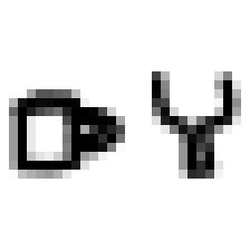
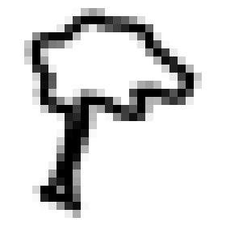
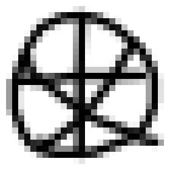

# 🎯 AI Pictionary Classifier

An end-to-end Computer Vision application that transforms hand-drawn sketches into real-time predictions using a custom PyTorch Convolutional Neural Network trained on the Google QuickDraw dataset.

Users can draw directly on an interactive canvas, send their sketch to a FastAPI backend, visualize the model's preprocessing pipeline, and receive confidence-ranked predictions instantly.

---

## ✨ Features

- 🖌️ **Interactive Drawing Canvas**: Built with React + TypeScript, supporting custom stroke widths, undo, clear, and replay.
- 🧠 **Custom PyTorch CNN**: Trained on 20 QuickDraw classes with **88.65% validation accuracy**.
- ⚡ **FastAPI Backend**: Low-latency REST API accepting both base64 image data and multipart file uploads.
- 📊 **Top-3 Confidence Predictions**: Interactive progress bars displaying softmax class probabilities.
- 🔍 **Model Vision Pipeline ("What The Model Sees")**: Real-time visualization of the exact $28\times 28$ grayscale tensor fed into the neural network.
- 🎨 **Natural Color Palette UI**: Styled with a custom nature-inspired theme (Beige, Dark Green, Midnight Green, Moss Green, and Rosy Brown).

---

## 🚀 How To Run

### 1. Clone Repository

```bash
git clone https://github.com/vaishnavifrsharma/vision-pictionary.git
cd vision-pictionary
```

---

### 2. Backend Setup

```bash
cd backend

python -m venv venv
source venv/bin/activate
# On Windows:
# venv\Scripts\activate

pip install -r requirements.txt
```

Start FastAPI server (pre-trained model `models/best_model.pth` is included out of the box):

```bash
uvicorn main:app --reload --port 8000
```

Backend runs on: `http://127.0.0.1:8000`

---

### 3. Frontend Setup

Open a new terminal:

```bash
cd frontend/vision-pictionary

npm install
npm run dev
```

Frontend runs on: `http://localhost:5173`

---

### 4. Start Drawing

1. Open `http://localhost:5173` in your browser.
2. Draw a sketch on the canvas (e.g. cup, car, tree, pizza, star).
3. Click **Predict**.
4. View:
   - Top-1 prediction highlight badge
   - Top-3 confidence progress bars
   - The exact $28\times 28$ preprocessed tensor seen by the model

---

## 📸 Sample Demo Drawings

| Cup Example | Car Example | Tree Example | Pizza Example |
| :---: | :---: | :---: | :---: |
|  |  |  |  |

---

## 🏗️ System Architecture

```text
React Drawing Canvas
          │
          ▼
     PNG Base64 / File
          │
          ▼
   FastAPI Endpoint
          │
          ▼
 Image Preprocessing
 (Margin Trim → Crop → Pad → MaxFilter Thickening → 28×28 Resize)
          │
          ▼
      28×28 Tensor
          │
          ▼
  PyTorch SketchCNN
          │
          ▼
 Softmax Probabilities
          │
          ▼
  Top-3 Predictions + Tensor Preview
```

---

## 🧠 Machine Learning & Preprocessing Pipeline

### Dataset
Google QuickDraw Dataset (20 Object Categories):
- `apple`, `banana`, `book`, `car`, `cat`, `chair`, `clock`, `cloud`, `cup`, `dog`, `fish`, `flower`, `guitar`, `house`, `ice cream`, `key`, `light bulb`, `pizza`, `star`, `tree`

### Preprocessing
To match QuickDraw dataset characteristics ($\sim 1.8 - 2.2\text{px}$ stroke width at $28\times 28$ resolution), each sketch undergoes:
1. **Flattening**: RGBA alpha composite onto white background.
2. **Inversion**: Color inversion so background = 0 (black) and stroke = $>0$ (white).
3. **Margin Trimming**: Outer 2% canvas margin stripping to eliminate frame artifacts.
4. **Bounding Box Crop**: Tight bounding box extraction of non-zero stroke pixels.
5. **Square Padding**: Aspect-ratio preserving square crop with ~14% relative padding.
6. **Adaptive Stroke Thickening**: `PIL.ImageFilter.MaxFilter` scaling line width to match QuickDraw pixel density.
7. **Downscaling**: Bilinear downsampling to $28\times 28$ and float $[0.0, 1.0]$ normalization.

---

## 🤖 Model Architecture & Performance

Custom Convolutional Neural Network (`SketchCNN`):

```text
Input (1 × 28 × 28)
  │
  ├── Conv2d(1 → 32, k=3, p=1) + ReLU + MaxPool2d(2)  ──> (32 × 14 × 14)
  ├── Conv2d(32 → 64, k=3, p=1) + ReLU + MaxPool2d(2) ──> (64 × 7 × 7)
  ├── Conv2d(64 → 128, k=3, p=1) + ReLU + MaxPool2d(2)──> (128 × 3 × 3)
  ├── Flatten (1152) ──> Linear(1152 → 256) + ReLU + Dropout(0.5)
  └── Linear(256 → 20) ──> Softmax Output
```

- **Validation Accuracy**: **88.65%** top-1 accuracy on QuickDraw test sets.
- **Model Checkpoint**: Included at `backend/models/best_model.pth` (1.5 MB).

---

## 🛠️ Tech Stack

- **Frontend**: React 18, TypeScript, HTML5 Canvas, Vanilla CSS3 (Custom Palette: Beige `#F7F4D5`, Dark Green `#0A3323`, Midnight Green `#105666`, Moss Green `#839958`, Rosy Brown `#D3968C`)
- **Backend**: FastAPI, Uvicorn, Python 3.10+, PIL (Pillow)
- **Machine Learning**: PyTorch, NumPy, Scikit-Learn, Matplotlib
- **Dataset**: Google QuickDraw

---

## 🎓 Key Learnings & Engineering Highlights

- **Preprocessing Mismatch Resolution**: Solved downsampling line fading and border leakage issues by implementing adaptive stroke dilation and margin trimming.
- **Transparent Model Explainability**: Exposed the intermediate $28\times 28$ tensor to demystify black-box neural network predictions.
- **Low-Latency Serving**: Optimized REST payload decoding to achieve sub-50ms inference time on CPU.

---

## 👩‍💻 Author

**Vaishnavi Sharma**  
Computer Vision • Machine Learning • Full Stack AI Applications